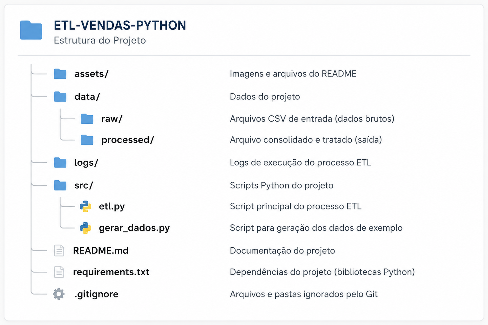
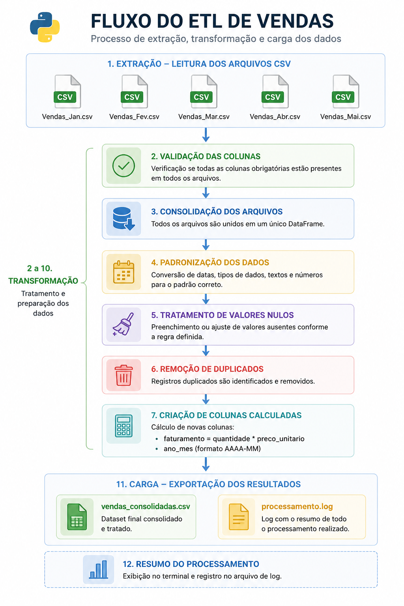
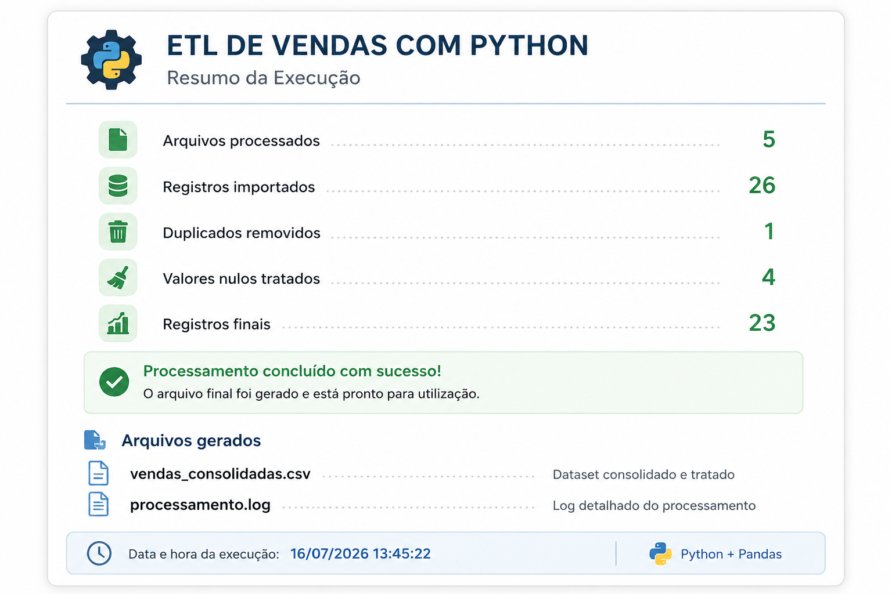

# ETL de Vendas com Python

## 📌 Objetivo

Este projeto simula um processo de ETL (Extract, Transform and Load) utilizando Python e Pandas.

O objetivo é importar múltiplos arquivos CSV contendo dados de vendas com inconsistências, realizar o tratamento dos dados, consolidar todas as informações em um único dataset e gerar um arquivo final pronto para análise.

---

## 🚀 Tecnologias Utilizadas

- Python 3.14
- Pandas
- VS Code

---

## 📂 Estrutura do Projeto



---

## 🔄 Fluxo do ETL



---

## ▶️ Execução

Ao executar o script `etl.py`, o processo consolida os arquivos CSV, aplica todas as etapas de tratamento dos dados, gera o dataset final e registra um resumo do processamento.



---

## 📊 Problemas simulados nos dados

Os arquivos utilizados possuem inconsistências comuns em processos reais de ETL, como:

- registros duplicados;
- valores nulos;
- datas em formatos diferentes;
- números armazenados como texto;
- textos com espaços extras;
- diferenças de letras maiúsculas e minúsculas.

---

## 📁 Arquivo gerado

Após o processamento é criado o arquivo:

```text
data/processed/vendas_consolidadas.csv
```

Também é gerado um log em:

```text
logs/processamento.log
```

---

## ▶️ Como executar

Clone o repositório:

```bash
git clone <url-do-repositorio>
```

Acesse a pasta do projeto:

```bash
cd etl-vendas-python
```

Instale as dependências:

```bash
pip install -r requirements.txt
```

Execute o ETL:

```bash
py src/etl.py
```

---

## 📈 Exemplo de saída

```text
Arquivos processados: 5
Registros importados: 26
Duplicados removidos: 1
Valores nulos tratados: 4
Registros finais: 23
```

---

## 💡 Principais conceitos praticados

Durante o desenvolvimento deste projeto foram aplicados conceitos de:

- ETL;
- Manipulação de DataFrames;
- Leitura de múltiplos arquivos;
- Limpeza e padronização de dados;
- Tratamento de valores nulos;
- Conversão de tipos de dados;
- Criação de colunas calculadas;
- Organização de código em funções;
- Geração de logs.

---

## 📌 Autor

Projeto desenvolvido por **Anderson Brandão** como parte do portfólio de estudos em Python para Engenharia e Análise de Dados.